# Task Dependency Graph

**Project**: Carlton USA Adobe Commerce B2B Migration  
**Generated**: 2025-07-03

## Visual Dependency Map

```mermaid
graph TD
    %% Sprint 0 - Risk Mitigation
    T001[T001: Legal Review] --> T002[T002: Data Extraction Plan]
    T001 --> T010[T010: Product Catalog Migration]
    T003[T003: Custom Product Prototype] --> T012[T012: Full Configurator]
    T004[T004: CSR Workflow Analysis] --> T018[T018: CSR Interface]

    %% Phase 1 - Foundation
    T005[T005: Environment Setup] --> T006[T006: CI/CD Pipeline]
    T005 --> T007[T007: Monitoring Setup]
    T005 --> T008[T008: B2B Account Structure]
    T008 --> T009[T009: Company Accounts]
    T002 --> T010
    T005 --> T011[T011: Shipper HQ Integration]

    %% Phase 2 - Core Features
    T003 --> T012
    T012 --> T013[T013: Dynamic Pricing]
    T009 --> T014[T014: Bulk Ordering]
    T010 --> T015[T015: Compliance Attributes]
    T005 --> T016[T016: Payment Gateway]
    T016 --> T017[T017: Payment Methods]

    %% Phase 3 - Advanced Features
    T004 --> T018
    T009 --> T018
    T005 --> T019[T019: Dynamics Integration]
    T005 --> T020[T020: Zoho CRM Integration]
    T012 --> T021[T021: Production Tracking]
    T011 --> T022[T022: Drop Shipping]
    T006 --> T023[T023: Performance Testing]

    %% Phase 4 - Launch
    T010 --> T024[T024: Final Migration]
    T015 --> T024
    T019 --> T024
    T020 --> T024
    AllFeatures[All Features Complete] --> T025[T025: UAT]
    T025 --> T026[T026: Training Materials]
    T025 --> T027[T027: Go-Live Prep]

    %% Critical Path Highlighting
    T001 -.->|CRITICAL PATH| T002
    T002 -.->|CRITICAL PATH| T010
    T003 -.->|HIGH RISK| T012
    T012 -.->|HIGH RISK| T013

    %% Phase Grouping
    subgraph "Sprint 0: Risk Mitigation"
        T001
        T002
        T003
        T004
    end

    subgraph "Phase 1: Foundation"
        T005
        T006
        T007
        T008
        T009
        T010
        T011
    end

    subgraph "Phase 2: Core Features"
        T012
        T013
        T014
        T015
        T016
        T017
    end

    subgraph "Phase 3: Advanced"
        T018
        T019
        T020
        T021
        T022
        T023
    end

    subgraph "Phase 4: Launch"
        T024
        T025
        T026
        T027
    end
```

## Critical Path Analysis

### Primary Critical Path
1. **T001** → **T002** → **T010** → **T024**
   - Legal Review → Data Extraction → Catalog Migration → Final Migration
   - Total duration: ~8 weeks
   - Risk: Any delay blocks entire data migration

### Secondary Critical Path
2. **T003** → **T012** → **T013** → **T021**
   - Custom Product Prototype → Full Configurator → Dynamic Pricing → Production Tracking
   - Total duration: ~10 weeks
   - Risk: Core business functionality (70% of revenue)

### Integration Dependencies
3. **T005** → Multiple Integration Tasks
   - Environment Setup blocks all technical work
   - Must be completed in first week

## Parallel Work Streams

### Stream 1: Infrastructure & Setup
- T005 (Environment) + T006 (CI/CD) + T007 (Monitoring)
- Can run parallel after environment ready

### Stream 2: B2B Features
- T008 (Account Structure) → T009 (Company Accounts) → T014 (Bulk Orders)
- Independent of custom products

### Stream 3: Integrations
- T019 (Dynamics) || T020 (Zoho) || T016 (Payments)
- Can run in parallel once environment ready

### Stream 4: Compliance & Catalog
- T015 (Compliance Attributes) can start after T010
- Independent of other features

## Risk Mitigation Through Dependencies

### Blocking Risks
1. **Legal Review (T001)**: Blocks all data work
2. **Custom Product Prototype (T003)**: Blocks configurator development
3. **Environment Setup (T005)**: Blocks all development

### High-Risk Dependencies
- T012 → T013: Configurator drives pricing complexity
- T010 → T024: Data migration quality affects go-live
- T025 → T027: UAT findings may delay launch

## Recommended Task Prioritization

### Sprint 0 (Weeks 1-2)
**Must Complete**: T001, T002, T003, T004
- Unblock all critical paths
- Validate technical approach

### Phase 1 (Weeks 3-6)
**Priority Order**:
1. T005 (Environment) - Day 1
2. T008 + T010 (parallel) - Week 1
3. T006 + T007 + T011 - Week 2
4. T009 - Week 3-4

### Phase 2 (Weeks 7-12)
**Priority Order**:
1. T012 (Configurator) - Weeks 7-9
2. T016 (Payments) - Week 7-8
3. T013 + T015 (parallel) - Week 10
4. T014 + T017 - Week 11-12

### Phase 3 (Weeks 13-18)
**Priority Order**:
1. T018 (CSR Interface) - Week 13-14
2. T019 + T020 (parallel) - Week 13-15
3. T021 + T022 - Week 16-17
4. T023 (Performance) - Week 18

### Phase 4 (Weeks 19-24)
**Sequential Order**:
1. T024 (Final Migration) - Week 19-20
2. T025 (UAT) - Week 21-22
3. T026 + T027 (parallel) - Week 23-24

## Resource Allocation by Dependencies

### Dedicated Resources Needed
- **Custom Product Developer**: T003 → T012 → T013 → T021
- **Integration Developer**: T011 → T016 → T019 → T020
- **B2B Developer**: T008 → T009 → T014 → T018
- **Data Migration Specialist**: T002 → T010 → T024

### Shared Resources
- **DevOps**: T005 → T006 → T007 → T027
- **QA Engineer**: T023 → T025
- **Business Analyst**: T004 → T026

## Notes

- Dependencies shown are technical/logical dependencies
- Resource dependencies may add additional constraints
- Critical path items should have dedicated resources
- Parallel streams should have separate team members to avoid context switching